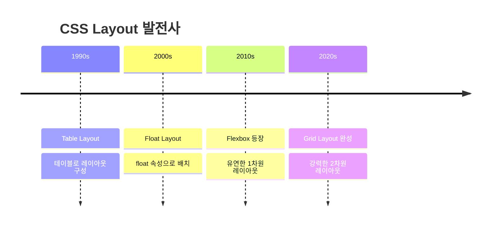
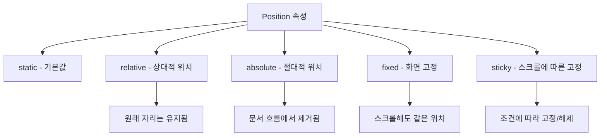
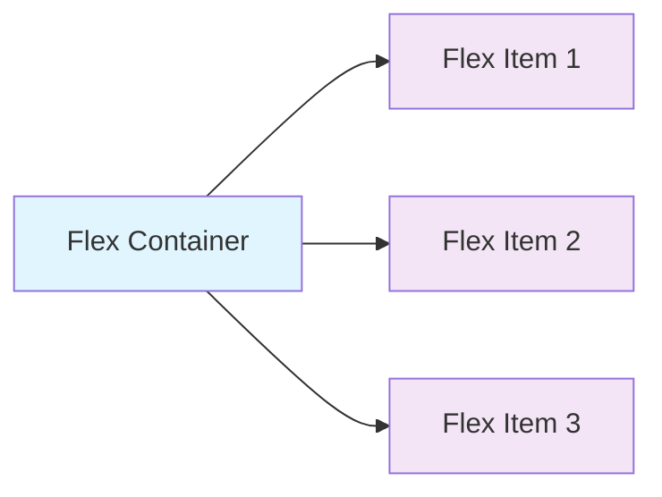
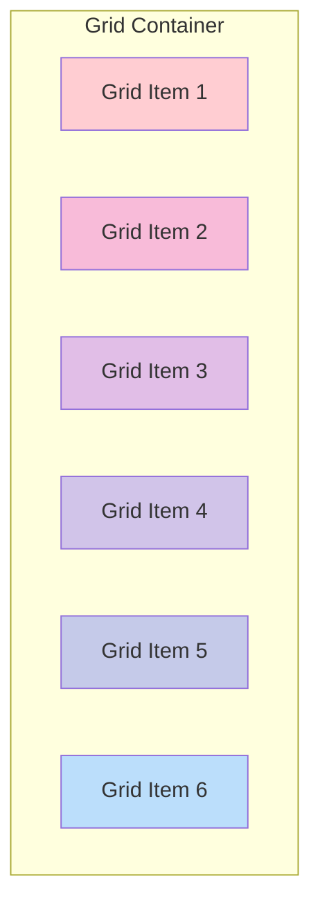
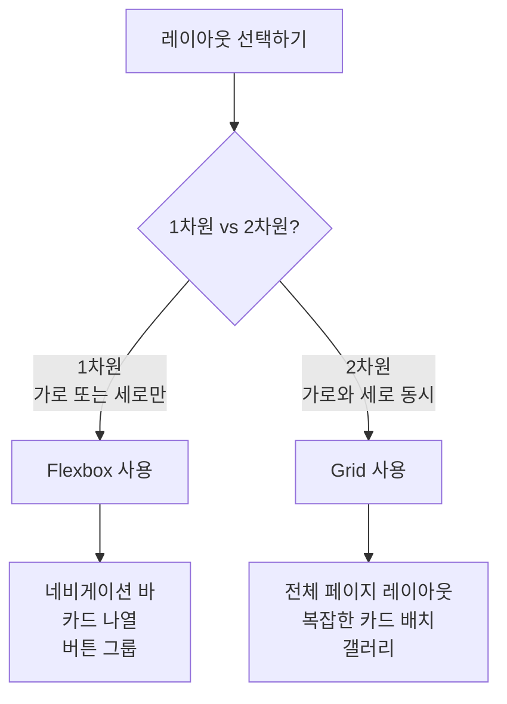
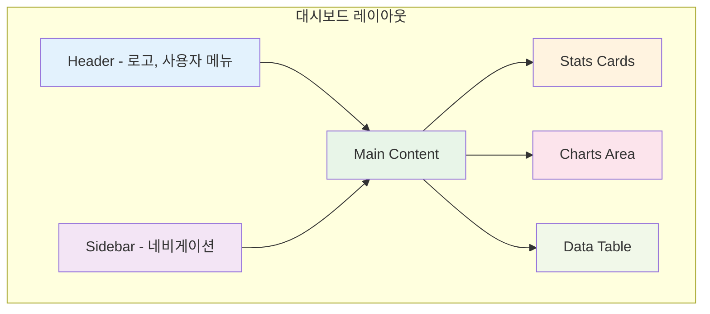

# CSS Layout 완전 정복 가이드 📐

> 2024.08.21 웹 개발 스터디 자료

## 📋 목차
1. [CSS Layout 기본 개념](#css-layout-기본-개념)
2. [주요 Layout 방법들](#주요-layout-방법들)
3. [Flexbox 완전 정복](#flexbox-완전-정복)
4. [Grid Layout 마스터](#grid-layout-마스터)
5. [실습 예제](#실습-예제)
6. [자주 묻는 질문](#자주-묻는-질문)

---

## CSS Layout 기본 개념

CSS Layout은 웹 페이지에서 요소들을 어떻게 배치할지 결정하는 핵심 기술입니다. 마치 방 안에 가구를 배치하는 것과 같이, HTML 요소들을 원하는 위치에 배치하는 방법을 제공합니다.

### Layout 발전 과정


---

## 주요 Layout 방법들

### 1. Normal Flow (일반 흐름)
가장 기본적인 배치 방법으로, HTML 요소들이 기본적으로 따르는 배치 규칙입니다.

```html
<!-- 기본 흐름 예제 -->
<div>첫 번째 블록</div>  <!-- 세로로 쌓임 -->
<div>두 번째 블록</div>  <!-- 세로로 쌓임 -->
<span>인라인1</span>     <!-- 가로로 나열 -->
<span>인라인2</span>     <!-- 가로로 나열 -->
```

### 2. Position 속성
요소의 위치를 정확히 제어할 수 있는 방법입니다.

```css
/* static: 기본값, 일반 흐름을 따름 */
.static-element {
    position: static; /* 기본값 */
}

/* relative: 원래 위치를 기준으로 상대적 이동 */
.relative-element {
    position: relative;
    top: 10px;     /* 원래 위치에서 아래로 10px */
    left: 20px;    /* 원래 위치에서 오른쪽으로 20px */
}

/* absolute: 가장 가까운 position이 relative인 부모 기준 */
.absolute-element {
    position: absolute;
    top: 0;        /* 부모의 맨 위에서 0px */
    right: 0;      /* 부모의 맨 오른쪽에서 0px */
}

/* fixed: 화면(viewport) 기준으로 고정 */
.fixed-element {
    position: fixed;
    bottom: 20px;  /* 화면 하단에서 20px 위 */
    right: 20px;   /* 화면 오른쪽에서 20px 왼쪽 */
}
```



---

## Flexbox 완전 정복

Flexbox는 1차원(가로 또는 세로) 레이아웃을 위한 강력한 도구입니다.

### Flexbox 기본 구조


### Flex Container 속성들

```css
/* 부모 요소에 적용하는 속성들 */
.flex-container {
    /* flexbox 활성화 */
    display: flex;
    
    /* 주축 방향 설정 */
    flex-direction: row;        /* 기본값: 가로 배치 */
    /* flex-direction: column; */   /* 세로 배치 */
    /* flex-direction: row-reverse; */ /* 가로 역순 */
    
    /* 아이템이 컨테이너를 넘을 때 처리 */
    flex-wrap: nowrap;          /* 기본값: 줄바꿈 없음 */
    /* flex-wrap: wrap; */         /* 줄바꿈 허용 */
    
    /* 주축에서 아이템 정렬 */
    justify-content: flex-start; /* 기본값: 시작점 정렬 */
    /* justify-content: center; */    /* 가운데 정렬 */
    /* justify-content: space-between; */ /* 양끝 정렬 */
    /* justify-content: space-around; */  /* 균등 분배 */
    
    /* 교차축에서 아이템 정렬 */
    align-items: stretch;       /* 기본값: 늘려서 채움 */
    /* align-items: center; */      /* 가운데 정렬 */
    /* align-items: flex-start; */  /* 시작점 정렬 */
}
```

### Flex Item 속성들

```css
/* 자식 요소에 적용하는 속성들 */
.flex-item {
    /* 늘어나는 비율 (기본값: 0) */
    flex-grow: 1;      /* 남는 공간을 1의 비율로 차지 */
    
    /* 줄어드는 비율 (기본값: 1) */
    flex-shrink: 1;    /* 공간이 부족할 때 1의 비율로 줄어듦 */
    
    /* 기본 크기 */
    flex-basis: auto;  /* 기본값: 내용 크기만큼 */
    /* flex-basis: 200px; */ /* 200px를 기본 크기로 설정 */
    
    /* 개별 정렬 */
    align-self: center; /* 이 아이템만 가운데 정렬 */
}

/* 축약형 */
.flex-item-short {
    flex: 1 1 auto; /* grow shrink basis 순서 */
    /* flex: 1; */  /* grow만 설정 (1 1 0과 동일) */
}
```

### 실제 활용 예제

```html
<!-- 네비게이션 바 만들기 -->
<nav class="navbar">
    <div class="logo">MyLogo</div>      <!-- 로고는 고정 크기 -->
    <ul class="nav-links">              <!-- 링크들은 가운데 -->
        <li><a href="#">Home</a></li>
        <li><a href="#">About</a></li>
        <li><a href="#">Contact</a></li>
    </ul>
    <div class="user-menu">Login</div>  <!-- 로그인은 오른쪽 -->
</nav>
```

```css
/* 네비게이션 바 스타일 */
.navbar {
    display: flex;              /* flexbox 활성화 */
    align-items: center;        /* 세로 가운데 정렬 */
    padding: 1rem;              /* 내부 여백 */
    background: #333;           /* 배경색 */
    color: white;               /* 글자색 */
}

.logo {
    font-size: 1.5rem;          /* 로고 크기 */
    font-weight: bold;          /* 굵게 */
}

.nav-links {
    display: flex;              /* 링크들도 flexbox로 */
    list-style: none;           /* 불릿 제거 */
    gap: 2rem;                  /* 링크 간 간격 */
    margin: 0 auto;             /* 가운데 정렬 */
}

.nav-links a {
    color: white;               /* 링크 색상 */
    text-decoration: none;      /* 밑줄 제거 */
}

.user-menu {
    margin-left: auto;          /* 자동으로 오른쪽 끝으로 */
}
```

---

## Grid Layout 마스터

Grid는 2차원(가로와 세로 동시) 레이아웃을 위한 최고의 도구입니다.

### Grid 기본 개념


### Grid Container 기본 설정

```css
.grid-container {
    /* grid 활성화 */
    display: grid;
    
    /* 열(column) 크기 정의 */
    grid-template-columns: 200px 1fr 200px;  /* 고정-유동-고정 */
    /* grid-template-columns: repeat(3, 1fr); */ /* 3개 균등 분할 */
    /* grid-template-columns: repeat(auto-fit, minmax(250px, 1fr)); */ /* 반응형 */
    
    /* 행(row) 크기 정의 */
    grid-template-rows: 80px 1fr 60px;       /* 헤더-본문-푸터 */
    
    /* 격자 간 간격 */
    gap: 20px;                  /* 모든 간격 20px */
    /* column-gap: 20px; */        /* 열 간격만 */
    /* row-gap: 10px; */           /* 행 간격만 */
    
    /* 최소 높이 설정 */
    min-height: 100vh;          /* 화면 전체 높이 */
}
```

### Grid Area로 레이아웃 설계

```css
/* 영역 이름으로 레이아웃 설계 */
.grid-layout {
    display: grid;
    grid-template-areas: 
        "header  header  header"    /* 첫 번째 행: 헤더가 3열 모두 차지 */
        "sidebar content aside"     /* 두 번째 행: 사이드바, 본문, 부가정보 */
        "footer  footer  footer";   /* 세 번째 행: 푸터가 3열 모두 차지 */
    
    grid-template-columns: 200px 1fr 200px; /* 열 크기 */
    grid-template-rows: 80px 1fr 60px;      /* 행 크기 */
    gap: 20px;
    min-height: 100vh;
}

/* 각 영역에 이름 할당 */
.header { 
    grid-area: header;      /* header 영역에 배치 */
    background: #2196f3;    /* 파란색 배경 */
}

.sidebar { 
    grid-area: sidebar;     /* sidebar 영역에 배치 */
    background: #4caf50;    /* 초록색 배경 */
}

.content { 
    grid-area: content;     /* content 영역에 배치 */
    background: #fff;       /* 흰색 배경 */
}

.aside { 
    grid-area: aside;       /* aside 영역에 배치 */
    background: #ff9800;    /* 주황색 배경 */
}

.footer { 
    grid-area: footer;      /* footer 영역에 배치 */
    background: #9e9e9e;    /* 회색 배경 */
}
```

### 반응형 Grid 만들기

```css
/* 모바일 우선 접근법 */
.responsive-grid {
    display: grid;
    gap: 1rem;
    padding: 1rem;
}

/* 모바일 (기본) */
.responsive-grid {
    grid-template-columns: 1fr;        /* 1열 레이아웃 */
    grid-template-areas:
        "header"
        "content"
        "sidebar"
        "footer";
}

/* 태블릿 (768px 이상) */
@media (min-width: 768px) {
    .responsive-grid {
        grid-template-columns: 1fr 300px;  /* 2열 레이아웃 */
        grid-template-areas:
            "header  header"
            "content sidebar"
            "footer  footer";
    }
}

/* 데스크톱 (1024px 이상) */
@media (min-width: 1024px) {
    .responsive-grid {
        grid-template-columns: 250px 1fr 250px; /* 3열 레이아웃 */
        grid-template-areas:
            "sidebar header  aside"
            "sidebar content aside"
            "footer  footer  footer";
    }
}
```

---

## 실습 예제

### 완전한 웹 페이지 레이아웃

```html
<!DOCTYPE html>
<html lang="ko">
<head>
    <meta charset="UTF-8">
    <meta name="viewport" content="width=device-width, initial-scale=1.0">
    <title>Modern Layout Example</title>
    <style>
        /* 전역 스타일 초기화 */
        * {
            margin: 0;              /* 기본 마진 제거 */
            padding: 0;             /* 기본 패딩 제거 */
            box-sizing: border-box; /* 패딩과 보더를 크기에 포함 */
        }
        
        body {
            font-family: 'Arial', sans-serif;  /* 폰트 설정 */
            line-height: 1.6;                  /* 줄 간격 */
            color: #333;                        /* 기본 텍스트 색상 */
        }
        
        /* 메인 그리드 컨테이너 */
        .page-grid {
            display: grid;                      /* 그리드 활성화 */
            grid-template-areas:
                "header"        /* 모바일: 1열 레이아웃 */
                "nav"
                "main"
                "sidebar"
                "footer";
            min-height: 100vh;                  /* 최소 화면 높이 */
            gap: 0;                            /* 간격 없음 */
        }
        
        /* 헤더 스타일 */
        .header {
            grid-area: header;                  /* header 영역 배치 */
            background: linear-gradient(135deg, #667eea 0%, #764ba2 100%); /* 그라데이션 */
            color: white;                       /* 흰색 텍스트 */
            padding: 2rem;                      /* 내부 여백 */
            text-align: center;                 /* 가운데 정렬 */
        }
        
        .header h1 {
            font-size: 2.5rem;                 /* 제목 크기 */
            margin-bottom: 0.5rem;              /* 아래 마진 */
        }
        
        /* 내비게이션 스타일 */
        .nav {
            grid-area: nav;                     /* nav 영역 배치 */
            background: #333;                   /* 어두운 배경 */
            padding: 0;                         /* 패딩 제거 */
        }
        
        .nav ul {
            display: flex;                      /* flexbox 사용 */
            list-style: none;                   /* 불릿 제거 */
            justify-content: center;            /* 가운데 정렬 */
            flex-wrap: wrap;                    /* 줄바꿈 허용 */
        }
        
        .nav li {
            margin: 0;                          /* 마진 제거 */
        }
        
        .nav a {
            display: block;                     /* 블록 요소로 */
            color: white;                       /* 흰색 텍스트 */
            text-decoration: none;              /* 밑줄 제거 */
            padding: 1rem 2rem;                 /* 클릭 영역 확대 */
            transition: background 0.3s;       /* 호버 효과 애니메이션 */
        }
        
        .nav a:hover {
            background: #555;                   /* 호버시 배경색 변경 */
        }
        
        /* 메인 콘텐츠 스타일 */
        .main {
            grid-area: main;                    /* main 영역 배치 */
            padding: 2rem;                      /* 내부 여백 */
            background: #f8f9fa;                /* 연한 회색 배경 */
        }
        
        .card-grid {
            display: grid;                      /* 카드 그리드 */
            grid-template-columns: repeat(auto-fit, minmax(250px, 1fr)); /* 반응형 카드 */
            gap: 1.5rem;                        /* 카드 간 간격 */
            margin-top: 2rem;                   /* 위 마진 */
        }
        
        .card {
            background: white;                  /* 흰색 배경 */
            border-radius: 8px;                 /* 둥근 모서리 */
            padding: 1.5rem;                    /* 내부 여백 */
            box-shadow: 0 2px 10px rgba(0,0,0,0.1); /* 그림자 효과 */
            transition: transform 0.3s, box-shadow 0.3s; /* 호버 애니메이션 */
        }
        
        .card:hover {
            transform: translateY(-5px);        /* 위로 살짝 이동 */
            box-shadow: 0 4px 20px rgba(0,0,0,0.15); /* 그림자 진하게 */
        }
        
        /* 사이드바 스타일 */
        .sidebar {
            grid-area: sidebar;                 /* sidebar 영역 배치 */
            background: #e9ecef;                /* 연한 회색 배경 */
            padding: 2rem;                      /* 내부 여백 */
        }
        
        .widget {
            background: white;                  /* 흰색 배경 */
            border-radius: 8px;                 /* 둥근 모서리 */
            padding: 1.5rem;                    /* 내부 여백 */
            margin-bottom: 1.5rem;              /* 아래 마진 */
            box-shadow: 0 2px 5px rgba(0,0,0,0.1); /* 그림자 */
        }
        
        /* 푸터 스타일 */
        .footer {
            grid-area: footer;                  /* footer 영역 배치 */
            background: #212529;                /* 어두운 배경 */
            color: white;                       /* 흰색 텍스트 */
            text-align: center;                 /* 가운데 정렬 */
            padding: 2rem;                      /* 내부 여백 */
        }
        
        /* 태블릿 사이즈 (768px 이상) */
        @media (min-width: 768px) {
            .page-grid {
                grid-template-areas:
                    "header header"     /* 2열 레이아웃 */
                    "nav nav"
                    "main sidebar"
                    "footer footer";
                grid-template-columns: 2fr 1fr;    /* 메인:사이드바 = 2:1 */
            }
            
            .nav ul {
                justify-content: flex-start;       /* 왼쪽 정렬 */
                padding-left: 2rem;                /* 왼쪽 패딩 */
            }
        }
        
        /* 데스크톱 사이즈 (1024px 이상) */
        @media (min-width: 1024px) {
            .page-grid {
                grid-template-areas:
                    "header header header"  /* 3열 레이아웃 */
                    "nav nav nav"
                    "main main sidebar"
                    "footer footer footer";
                grid-template-columns: 2fr 1fr 1fr; /* 복잡한 비율 */
                max-width: 1200px;                   /* 최대 너비 제한 */
                margin: 0 auto;                      /* 가운데 정렬 */
            }
        }
        
        /* 다크모드 (사용자가 선호하는 경우) */
        @media (prefers-color-scheme: dark) {
            body {
                background: #1a1a1a;               /* 어두운 배경 */
                color: #e0e0e0;                     /* 밝은 텍스트 */
            }
            
            .main {
                background: #2d2d2d;                /* 어두운 메인 배경 */
            }
            
            .card, .widget {
                background: #3d3d3d;                /* 어두운 카드 배경 */
                color: #e0e0e0;                     /* 밝은 텍스트 */
            }
        }
        
        /* 애니메이션 정의 */
        @keyframes fadeIn {
            from { 
                opacity: 0;                         /* 투명에서 시작 */
                transform: translateY(20px);        /* 아래에서 시작 */
            }
            to { 
                opacity: 1;                         /* 불투명하게 */
                transform: translateY(0);           /* 원래 위치로 */
            }
        }
        
        /* 페이지 로드시 애니메이션 적용 */
        .card {
            animation: fadeIn 0.6s ease-out;       /* 애니메이션 적용 */
        }
        
        /* n번째 카드마다 지연시간 추가 */
        .card:nth-child(1) { animation-delay: 0.1s; }
        .card:nth-child(2) { animation-delay: 0.2s; }
        .card:nth-child(3) { animation-delay: 0.3s; }
    </style>
</head>
<body>
    <div class="page-grid">
        <!-- 헤더 영역 -->
        <header class="header">
            <h1>Modern Web Layout</h1>
            <p>CSS Grid와 Flexbox를 활용한 반응형 레이아웃</p>
        </header>
        
        <!-- 네비게이션 영역 -->
        <nav class="nav">
            <ul>
                <li><a href="#home">Home</a></li>
                <li><a href="#about">About</a></li>
                <li><a href="#services">Services</a></li>
                <li><a href="#portfolio">Portfolio</a></li>
                <li><a href="#contact">Contact</a></li>
            </ul>
        </nav>
        
        <!-- 메인 콘텐츠 영역 -->
        <main class="main">
            <h2>Welcome to Our Website</h2>
            <p>이 페이지는 최신 CSS 기술을 사용하여 만들어진 반응형 웹사이트입니다. 
               Grid Layout과 Flexbox를 조합하여 모든 디바이스에서 완벽하게 작동합니다.</p>
            
            <!-- 카드 그리드 -->
            <div class="card-grid">
                <div class="card">
                    <h3>🎨 Design</h3>
                    <p>아름답고 직관적인 디자인으로 사용자 경험을 향상시킵니다.</p>
                </div>
                <div class="card">
                    <h3>📱 Responsive</h3>
                    <p>모든 디바이스에서 완벽하게 작동하는 반응형 레이아웃입니다.</p>
                </div>
                <div class="card">
                    <h3>⚡ Performance</h3>
                    <p>최적화된 코드로 빠른 로딩 속도를 보장합니다.</p>
                </div>
            </div>
        </main>
        
        <!-- 사이드바 영역 -->
        <aside class="sidebar">
            <div class="widget">
                <h3>📢 Notice</h3>
                <p>새로운 업데이트가 있습니다!</p>
                <p>CSS Grid 가이드를 확인해보세요.</p>
            </div>
            
            <div class="widget">
                <h3>📊 Statistics</h3>
                <ul style="list-style: none; padding: 0;">
                    <li style="margin: 0.5rem 0;">방문자: 1,234명</li>
                    <li style="margin: 0.5rem 0;">페이지뷰: 5,678회</li>
                    <li style="margin: 0.5rem 0;">평점: ⭐⭐⭐⭐⭐</li>
                </ul>
            </div>
        </aside>
        
        <!-- 푸터 영역 -->
        <footer class="footer">
            <p>&copy; 2024 Modern Web Layout. All rights reserved.</p>
            <p>CSS Grid & Flexbox 학습 자료</p>
        </footer>
    </div>
</body>
</html>
```

---

## 자주 묻는 질문

### Q1: Flexbox와 Grid 언제 사용하나요?



### Q2: 반응형 디자인 브레이크포인트는?

```css
/* 모바일 우선 (Mobile First) 접근법 추천 */

/* 모바일 (기본값) - ~767px */
.container { 
    padding: 1rem; 
}

/* 태블릿 - 768px~ */
@media (min-width: 768px) {
    .container { 
        padding: 2rem;
        max-width: 750px;
        margin: 0 auto;
    }
}

/* 데스크톱 - 1024px~ */
@media (min-width: 1024px) {
    .container { 
        padding: 3rem;
        max-width: 1200px;
    }
}

/* 대형 화면 - 1440px~ */
@media (min-width: 1440px) {
    .container { 
        max-width: 1400px;
    }
}
```

### Q3: 가운데 정렬하는 방법들

```css
/* 방법 1: Flexbox (가장 간단) */
.flex-center {
    display: flex;
    justify-content: center;    /* 가로 가운데 */
    align-items: center;        /* 세로 가운데 */
    min-height: 100vh;         /* 전체 화면 높이 */
}

/* 방법 2: Grid (매우 간단) */
.grid-center {
    display: grid;
    place-items: center;        /* 가로세로 모두 가운데 */
    min-height: 100vh;
}

/* 방법 3: Position + Transform (예전 방식) */
.position-center {
    position: absolute;
    top: 50%;                   /* 위에서 50% */
    left: 50%;                  /* 왼쪽에서 50% */
    transform: translate(-50%, -50%); /* 자기 크기의 절반만큼 뒤로 */
}

/* 방법 4: Margin Auto (수평 가운데만) */
.margin-center {
    width: 300px;              /* 고정 너비 필요 */
    margin: 0 auto;            /* 좌우 마진 자동 */
}
```

### Q4: 스크롤 없는 전체 화면 레이아웃 만들기

```css
/* 전체 화면을 채우는 레이아웃 */
.fullscreen-layout {
    display: grid;
    grid-template-rows: auto 1fr auto;  /* 헤더-본문-푸터 */
    grid-template-areas:
        "header"
        "main"  
        "footer";
    height: 100vh;              /* 뷰포트 전체 높이 */
    overflow: hidden;           /* 전체 스크롤 방지 */
}

.header {
    grid-area: header;
    background: #333;
    color: white;
    padding: 1rem;
}

.main {
    grid-area: main;
    overflow-y: auto;           /* 본문만 스크롤 가능 */
    padding: 2rem;
}

.footer {
    grid-area: footer;
    background: #666;
    color: white;
    padding: 1rem;
    text-align: center;
}
```

### Q5: 카드 레이아웃 만들기

```css
/* 반응형 카드 그리드 */
.card-container {
    display: grid;
    /* 최소 250px, 최대 1fr로 자동 맞춤 */
    grid-template-columns: repeat(auto-fit, minmax(250px, 1fr));
    gap: 2rem;                  /* 카드 간격 */
    padding: 2rem;
}

.card {
    background: white;
    border-radius: 12px;        /* 둥근 모서리 */
    box-shadow: 
        0 4px 6px rgba(0, 0, 0, 0.1),      /* 기본 그림자 */
        0 1px 3px rgba(0, 0, 0, 0.08);     /* 세부 그림자 */
    overflow: hidden;           /* 넘치는 부분 숨김 */
    transition: all 0.3s ease;  /* 부드러운 애니메이션 */
}

.card:hover {
    transform: translateY(-8px); /* 위로 이동 */
    box-shadow: 
        0 20px 25px rgba(0, 0, 0, 0.15),
        0 10px 10px rgba(0, 0, 0, 0.04);
}

/* 카드 내부 구조 */
.card-image {
    width: 100%;
    height: 200px;
    object-fit: cover;          /* 이미지 비율 유지하며 크롭 */
    background: #f0f0f0;
}

.card-content {
    padding: 1.5rem;
}

.card-title {
    font-size: 1.25rem;
    font-weight: bold;
    margin-bottom: 0.5rem;
    color: #333;
}

.card-text {
    color: #666;
    line-height: 1.6;
    margin-bottom: 1rem;
}

.card-button {
    display: inline-flex;       /* 버튼을 인라인 flex로 */
    align-items: center;        /* 세로 가운데 정렬 */
    padding: 0.75rem 1.5rem;
    background: #007bff;
    color: white;
    text-decoration: none;
    border-radius: 6px;
    font-weight: 500;
    transition: background 0.2s;
}

.card-button:hover {
    background: #0056b3;        /* 어두운 파란색 */
}
```

---

## 고급 기법들

### CSS Custom Properties (CSS 변수) 활용

```css
/* CSS 변수 정의 */
:root {
    --primary-color: #007bff;      /* 주요 색상 */
    --secondary-color: #6c757d;    /* 보조 색상 */
    --success-color: #28a745;      /* 성공 색상 */
    --warning-color: #ffc107;      /* 경고 색상 */
    --danger-color: #dc3545;       /* 위험 색상 */
    
    --font-size-sm: 0.875rem;      /* 작은 글자 */
    --font-size-base: 1rem;        /* 기본 글자 */
    --font-size-lg: 1.125rem;      /* 큰 글자 */
    --font-size-xl: 1.25rem;       /* 더 큰 글자 */
    
    --spacing-xs: 0.25rem;         /* 4px */
    --spacing-sm: 0.5rem;          /* 8px */
    --spacing-md: 1rem;            /* 16px */
    --spacing-lg: 1.5rem;          /* 24px */
    --spacing-xl: 3rem;            /* 48px */
    
    --border-radius: 0.375rem;     /* 6px */
    --box-shadow: 0 1px 3px rgba(0, 0, 0, 0.12), 
                  0 1px 2px rgba(0, 0, 0, 0.24);
}

/* 다크 테마 */
@media (prefers-color-scheme: dark) {
    :root {
        --bg-color: #1a1a1a;
        --text-color: #e0e0e0;
        --card-bg: #2d2d2d;
    }
}

/* 변수 사용 예시 */
.button {
    background: var(--primary-color);     /* 변수 사용 */
    color: white;
    padding: var(--spacing-sm) var(--spacing-md);
    border-radius: var(--border-radius);
    box-shadow: var(--box-shadow);
    border: none;
    cursor: pointer;
    transition: all 0.2s ease;
}

.button:hover {
    /* calc() 함수로 색상 어둡게 만들기 */
    filter: brightness(0.9);
}

.button--secondary {
    background: var(--secondary-color);   /* 다른 색상 변수 사용 */
}
```

### Container Queries (최신 기능)

```css
/* 컨테이너 기반 반응형 디자인 */
.card-container {
    container-type: inline-size;    /* 컨테이너 쿼리 활성화 */
    container-name: card-grid;      /* 컨테이너 이름 지정 */
}

/* 컨테이너가 400px 이상일 때 */
@container card-grid (min-width: 400px) {
    .card {
        display: flex;              /* 가로 배치로 변경 */
    }
    
    .card-image {
        width: 150px;               /* 이미지 크기 고정 */
        height: 100px;
    }
    
    .card-content {
        flex: 1;                    /* 나머지 공간 차지 */
    }
}
```

### Scroll-driven Animations

```css
/* 스크롤에 따른 애니메이션 */
.scroll-animation {
    animation: fade-in-up linear both;
    animation-timeline: view();     /* 뷰포트 기준 */
    animation-range: entry 0% cover 30%;
}

@keyframes fade-in-up {
    from {
        opacity: 0;
        transform: translateY(50px);
    }
    to {
        opacity: 1;
        transform: translateY(0);
    }
}
```

---

## 성능 최적화 팁

### CSS 최적화

```css
/* DO: 효율적인 선택자 사용 */
.button { }                    /* 클래스 선택자 (빠름) */
#header { }                    /* ID 선택자 (빠름) */

/* DON'T: 비효율적인 선택자 */
div > p > a { }               /* 복잡한 자식 선택자 (느림) */
* { }                         /* 전체 선택자 (느림) */

/* DO: CSS 변수로 재사용성 증대 */
:root {
    --primary: #007bff;
    --shadow: 0 2px 4px rgba(0,0,0,0.1);
}

/* DO: transform과 opacity만 애니메이션 */
.animate-element {
    transition: transform 0.3s, opacity 0.3s;
}

/* DON'T: 레이아웃을 변경하는 속성 애니메이션 */
.slow-animation {
    transition: width 0.3s, height 0.3s; /* 리플로우 발생 */
}
```

### 반응형 이미지

```css
/* 반응형 이미지 최적화 */
.responsive-image {
    width: 100%;
    height: auto;
    max-width: 100%;
    object-fit: cover;          /* 비율 유지하며 크롭 */
}

/* 다양한 화면 밀도 대응 */
.hero-image {
    background-image: url('hero-small.jpg');
}

@media (min-width: 768px) {
    .hero-image {
        background-image: url('hero-medium.jpg');
    }
}

@media (min-width: 1200px) {
    .hero-image {
        background-image: url('hero-large.jpg');
    }
}

/* 고밀도 화면 대응 */
@media (-webkit-min-device-pixel-ratio: 2), 
       (min-resolution: 192dpi) {
    .hero-image {
        background-image: url('hero-2x.jpg');
    }
}
```

---

## 실전 프로젝트: 완성된 대시보드



이 가이드를 통해 CSS Layout의 핵심 개념부터 실전 활용까지 모든 내용을 다뤘습니다. 각 코드에는 상세한 주석을 달아 비전공자도 쉽게 이해할 수 있도록 구성했습니다.

### 다음 단계 추천
1. **기본기 연습**: Flexbox와 Grid 속성들을 하나씩 실험해보세요
2. **실제 프로젝트**: 간단한 웹사이트를 만들어보세요
3. **고급 기법**: CSS 변수와 애니메이션을 추가해보세요
4. **최적화**: 성능과 접근성을 고려한 코드로 개선해보세요

궁금한 점이나 특정 부분에 대한 추가 설명이 필요하시면 언제든 말씀해 주세요! 🚀